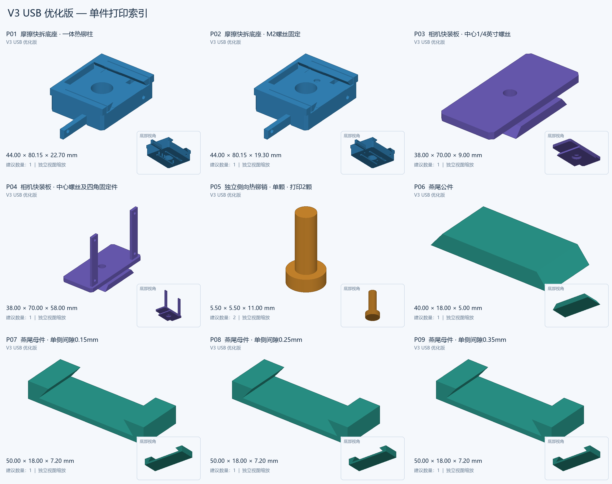
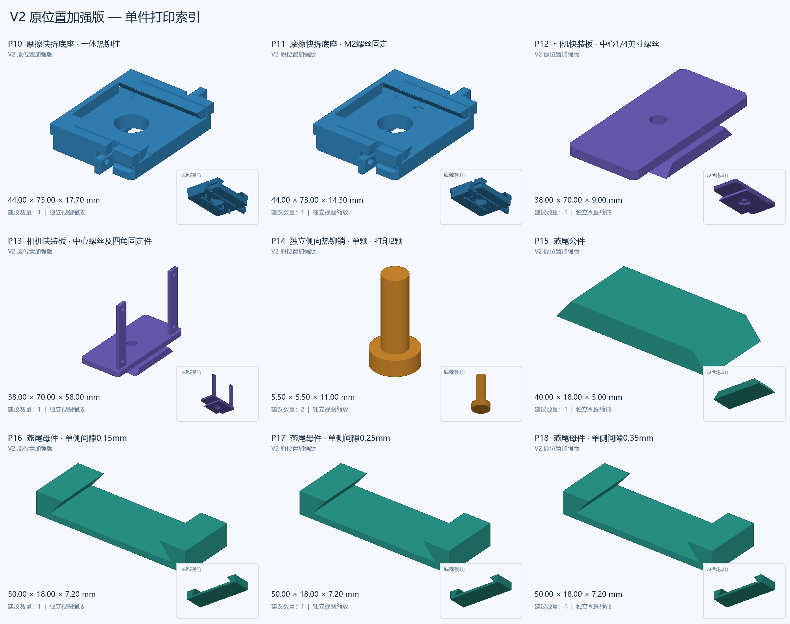
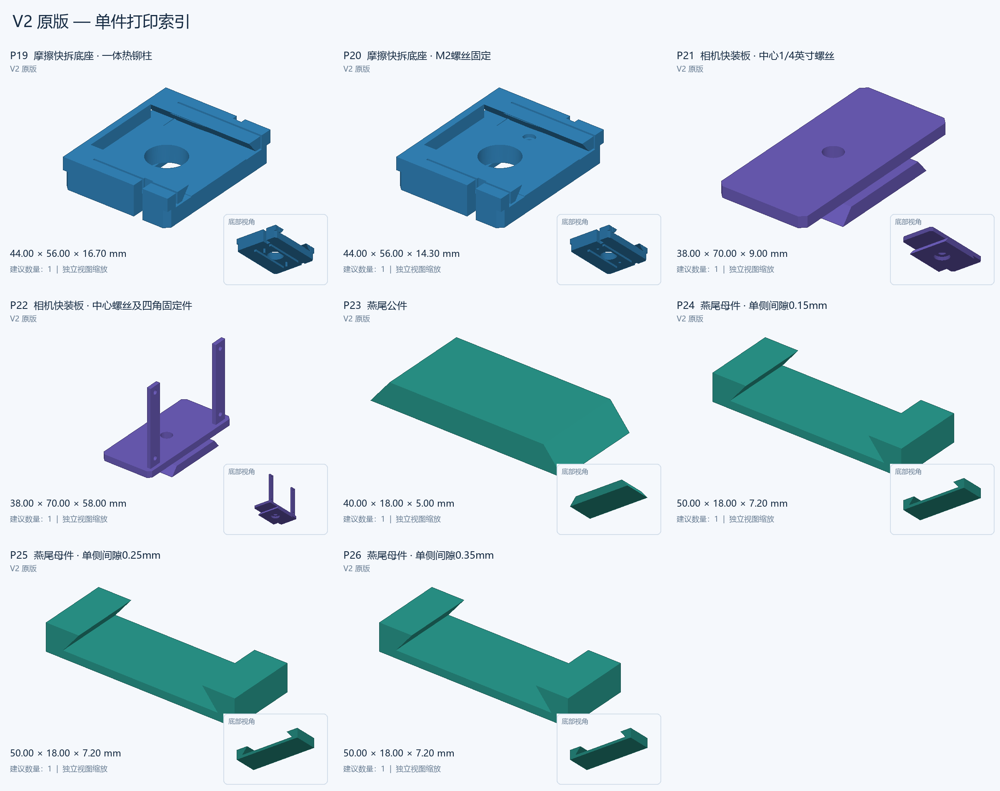

# 云台机械件与 MaixCAM2 快拆转接台

同步日期：2026-10-03。本目录包含相机转接台的源模型、可编辑 Fusion 文件、STEP、单件 STL、缩略图、复建脚本及验证记录，以及此前两个版本的电机支架与连接板。同步清单和 SHA-256 位于 [SYNC_MANIFEST.json](SYNC_MANIFEST.json)。

## 快速定位打印零件

- [V3 USB 优化版单件 STL](gimbalconnector/STL_单件打印_2026-10-03/01_V3_USB优化版/)：当前预留 USB 空间的版本。
- [V2 原位置加强版单件 STL](gimbalconnector/STL_单件打印_2026-10-03/02_V2_原位置加强版/)：保留相机原位置，增加底部热铆柱与侧向热铆销。
- [V2 原版单件 STL](gimbalconnector/STL_单件打印_2026-10-03/03_V2_原版/)：最初确认长边对齐的版本。
- [单件打印说明](gimbalconnector/STL_单件打印_2026-10-03/README_打印说明.md)与[打印清单](gimbalconnector/STL_单件打印_2026-10-03/打印清单.csv)。
- [离线零件索引 HTML](gimbalconnector/零件缩略图_2026-10-03/零件索引.html)：克隆或下载仓库后用浏览器打开，可筛选并访问对应 STL。GitHub 页面显示 HTML 源码，可直接查看下方 PNG 总览。

每套选择一个底座和一种相机快装板。加强版与 USB 版另需 **2 颗独立侧向热铆销**；铆销 STL 只有一颗。底部热铆柱与底座、四角固定立边与相机板分别一体打印。金属螺丝不作为打印件。

### V3 USB 优化版

### V2 原位置加强版

### V2 原版

V1 相机方向未采用，仍保留在历史目录，详见 [项目说明](gimbalconnector/README.md)。

## 以前两个版本的电机支架

按本地原文件名称分组，不修改模型或打印坐标：

| 版本 | 电机支架 | 连接板 |
|---|---|---|
| 原版 V1 | [电机支架.stl](motor_brackets/v1/电机支架.stl) | [电机支架连接板.stl](motor_brackets/v1/电机支架连接板.stl) |
| 第二版 V2 | [电机支架2.stl](motor_brackets/v2/电机支架2.stl) | [电机支架连接板2.stl](motor_brackets/v2/电机支架连接板2.stl) |

电机支架的 V1/V2 是这四个原始文件的版本标签，与相机快拆转接台 V1/V2/V3 独立。没有根据版本号推定两者互换兼容性。

## 编辑与验证

[转接台项目入口](gimbalconnector/README.md)介绍各版 Fusion/STEP、源模型及建模脚本；[加强版和 USB 空间说明](gimbalconnector/README_加强版与USB优化.md)介绍孔位、热铆顺序、USB 插头包络和螺丝空间。

相机转接台的 34 个单件 STL 已完成封闭性、单一连通性及尺寸保持检查，34 张缩略图逐一对应 STL，索引筛选已检查。本次四个电机支架文件仅进行原样复制、二进制 STL 格式和哈希核验。实际打印、热铆强度、摩擦保持力及完整云台运动尚未验证。
