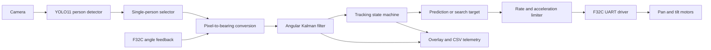
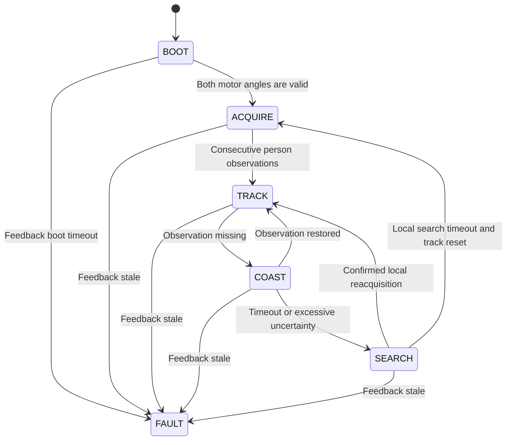

# Software Architecture

## Design objective

The Stage 1 application proves that perception, angular state estimation, loss handling, and F32C command generation can form a stable closed loop around one person. Target-specific code is kept behind the detector adapter so a drone model can replace the person model later.

## Runtime data flow



## Module boundaries

### `perception`

`YoloPersonDetector` is the only module that knows about MaixPy YOLO result objects. It converts every accepted result into the project's immutable `Detection` type.

`TargetSelector` owns target identity at the simple Stage 1 level. During acquisition it favors a confident, large, central person. After a track exists, it gates candidates by angular distance from the predicted bearing and adds image-space overlap as a continuity cue.

The future MixFormerV2 adapter belongs in this layer. It should produce the same `Detection`-like image observation and must not command the gimbal directly.

### `estimation`

`CameraModel` converts a bounding-box center into relative ray angles and then into installation-frame azimuth and elevation using gimbal feedback. Stage 1 uses independent pan and tilt angle addition. A later calibrated 3D rotation can replace this implementation without affecting downstream modules.

`TargetFilter` contains two independent two-state Kalman filters:

```text
azimuth axis:   [position, angular_rate]
elevation axis: [position, angular_rate]
```

The process model assumes constant angular velocity with white angular-acceleration noise. Position covariance grows during missing measurements and becomes an input to the loss-recovery decision.

### `control`

`TrackingStateMachine` is the only authority for operating mode. Perception code reports whether a measurement exists; it does not decide whether the system should coast, search, or fault.

`ExpandingSearchPattern` creates a bounded two-axis Lissajous scan around the last predicted bearing. Its amplitude grows with search time.

`GimbalController` adds a short prediction horizon and applies software angle, rate, and acceleration limits. It outputs a `GimbalCommand` and contains no UART code.

### `drivers`

`f32c_protocol.py` is a pure binary codec. It creates frames, calculates XOR BCC values, and incrementally parses nine-byte feedback frames.

`F32CGimbal` exclusively owns UART4. No other module may call the UART API. It performs pin mapping, initialization, command serialization, feedback polling, coordinate sign conversion, hold, fault, and shutdown behavior.

`VisionOnlyGimbal` implements the same interface with a fixed zero pose and no hardware output. This keeps the entire application path active while motion is disabled.

### `telemetry`

`AsyncCsvLogger` uses a bounded queue. If storage cannot keep up, diagnostic samples are discarded instead of delaying the control loop.

`overlay.py` draws the selected detection, filtered prediction, operating mode, gimbal pose, and angular state.

## State machine



When the gimbal is disabled in configuration, `VisionOnlyGimbal` supplies a valid stationary pose so the perception and state-estimation path can still advance through the same modes.

## Motor operating mode

The driver selects F32C direct multi-turn position mode (`0x0003`) after enabling each motor. Position targets use function `0x02` with signed degrees multiplied by ten. The configured RPM value limits motion while the F32C internal loops perform the low-level control.

Direct position mode was selected because it accepts frequent target updates and holds the last target if application updates stop. A raw speed-mode outer loop would create a greater runaway risk after a process failure.

## Timing

The image loop runs as quickly as camera capture, inference, and display allow. Position commands are rate-limited separately by `command_period_ms`. Angle feedback requests alternate between the two motor IDs. All UART frames pass through a single writer and observe the configured inter-frame gap.

Stage 1 timestamps an image immediately after `camera.read()` and uses the most recent motor angles. A later implementation should keep a timestamped gimbal-pose ring buffer and interpolate pose at the sensor exposure timestamp.

## Safety behavior

- Mechanical angle limits are applied before every position command.
- Command position, velocity, and acceleration are bounded in software.
- Missing or stale feedback enters `FAULT`.
- The default fault policy holds the current angle and then disables both motors.
- Normal application exit holds the latest position unless `disable_on_normal_exit` is enabled.
- Physical power isolation, fusing, hard stops, and an operator-accessible power cut-off remain hardware responsibilities.

## Extension points

The next implementation steps should preserve the current data contracts:

1. add a MixFormerV2 adapter under `perception`;
2. add timestamped motor-pose interpolation under `estimation`;
3. add dynamic high-resolution ROI management;
4. replace `YoloPersonDetector` with `YoloDroneDetector`;
5. add appearance similarity to reacquisition scoring;
6. fuse IMU angular rate with encoder pose;
7. move measured hot paths to MaixCDK only if profiling justifies it.
