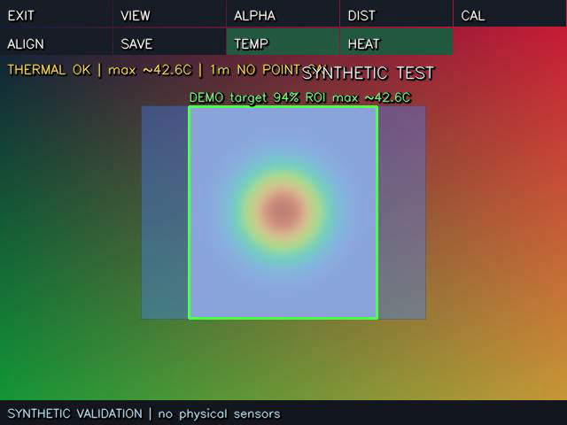

# MaixCAM2：Thermal160 + YOLO 融合与 RTSP

在可见光画面上叠加 Thermal160 伪彩图，显示 YOLO 检测框、类别、置信度及框内最高温度；**屏幕和 RTSP 输出来自同一张最终合成图**。

主入口是 [main.py](main.py)，已做成一个独立文件，不依赖 src/ 或旁边其他 Python 文件。可在 MaixVision 中运行当前文件，也可以打开本目录运行整个项目。

已新增 **多距离点对校准**：适配热像镜头在相机右侧5cm、下方5cm且视场不同的安装。默认0.5/1/2/3/5米独立配置，由实际对应点求映射，运行时按DIST选择。详见 [校准操作说明](CALIBRATION.md)。默认配置还没有你的实测校准数据。

变距离动态对齐与真正的热像 YOLO 的实施路径、所需硬件和模型数据见 [动态对齐与热像识别设计](DYNAMIC_ALIGNMENT_AND_THERMAL_YOLO.md)。现有 YOLO 模型检测的是 RGB 帧；热像层上的标签来自几何映射。

现在还可在**热像原始帧**上识别较热的连通区域，在设备屏幕点选其中一块后单独跟踪，详见下方“单点热块跟踪”。此功能不使用YOLO，也不改变已有的手动多距离校准与SAVE数据。

相机 RGB888 到合成图现使用单次 RGB 复制，修正旧版在 `image2cv(copy=False)` 后多交换一次红蓝通道的偏色。屏幕与 RTSP 仍输出同一张 RGB 合成图。顶栏新增独立的 TEMP、HEAT 开关；HOT 负责热块点选与跟踪。

已新增[帧率控制与阻塞诊断](PERFORMANCE.md)：可见光请求60fps、合成不限速、热像保持原UART节奏；用户反馈子进程版首帧停住后，默认改为同进程间隔YOLO（上限10次/秒），每次推理仍会暂时阻塞显示。独立进程模式保留为实验选项。屏幕分别显示V/T/AI/NET实测频率。切换相机帧率模式后需要重新校准。

## 在 MaixVision 运行

1. 连接 **MaixCAM2**，安装好 **Thermal160 PMOD**。模块必须输出带30字节遥测的UART协议，不是旧灰度固件或USB UVC固件。
2. 在 MaixVision 中打开本目录的 **main.py**。
3. 首次通常无需改路径：代码按顺序寻找设备上的：
   - `/root/models/yolo11n.mud`
   - `/root/models/yolo11s.mud`
   - `/root/models/yolov8n.mud`
4. 如果模型放在其他位置，修改 main.py 顶部 CONFIG：

   ```python
   "model_path": "/root/models/你的模型.mud",
   "model_type": "YOLO11",  # 或 YOLOv8 / YOLOv5
   ```

   `.mud` 及其引用的 **MaixCAM2 `.axmodel`** 必须已经在板上。仓库没有打包模型权重，不会自动下载模型。没有模型时会给出明确错误，不能把电脑上的文件路径填到这里。

5. 点击 **运行当前文件**。正常时屏幕和 MaixVision 预览应显示融合画面，终端打印 `PLAY: rtsp://实际设备IP:8554/live`。
6. 首次按 **DIST** 选工作距离，再按 **CAL**，按[校准说明](CALIBRATION.md)冻结画面、选6～12组拟合点及至少2组独立检查点，APPLY后SAVE。ALIGN仅用于粗调，默认全幅叠加不能认为已标定。

运行依赖与官方热成像应用相同：板上 MaixPy v4、NumPy、OpenCV，另用 Python 标准库。**板上无需安装 ffmpeg、MediaMTX 或额外 RTSP Python 包。**

## 播放合成视频

电脑和设备在同一局域网，或已通过 USB 虚拟网卡连通。用终端打印的地址替换下面的 `设备IP`。

VLC：

```text
vlc --rtsp-tcp "rtsp://设备IP:8554/live"
```

ffplay：

```text
ffplay -rtsp_transport tcp -i "rtsp://设备IP:8554/live"
```

想降低播放器缓存时，可尝试：

```text
ffplay -rtsp_transport tcp -fflags nobuffer -flags low_delay -framedrop -i "rtsp://设备IP:8554/live"
```

该版本实现 **RTSP + RTP/JPEG，TCP transport**，默认640×480、最多30fps、JPEG质量70、最多2个客户端。实际帧率取决于板上处理与网络速度，30fps是推流上限，不是实测承诺。

- 这是RTSP视频流；不是HTTP MJPEG，也不是WebRTC或H.264。
- 只支持RTSP over TCP；UDP SETUP会明确返回461。
- 浏览器地址栏不能直接播放RTSP；当前使用VLC/ffplay。
- 该服务用于局域网，没有音频和认证，不应直接暴露到公网。
- 原生 MaixCAM2 `rtsp.Rtsp.write()` / `webrtc.WebRTC.write()` 在核查版本中未实现，因此这里没有使用会绕过合成图的 `bind_camera()`。详细依据见 [推流接口核查](STREAMING_BACKEND.md)。

## 屏幕操作

| 按钮 | 功能 |
|---|---|
| EXIT | 退出并关闭UART、相机和RTSP；也可按MaixVision停止或设备USER键 |
| VIEW | 切换FUSION、VISIBLE、THERMAL；检测始终来自可见光 |
| ALPHA | 调整热像透明度 |
| DIST | 切换0.5/1/2/3/5米校准档位，可在CONFIG修改 |
| CAL | 冻结双光图，选择对应点，拟合并用独立点检查后应用 |
| ALIGN | 显示热像覆盖边框、前后缩放、位置/尺寸调整按钮 |
| FAR / NEAR | 推远缩小 / 拉近放大；保持中心与宽高比例 |
| FINE / RESET | 切换细调 / 恢复当前档位基础映射 |
| LEFT / RIGHT / UP / DOWN | 移动热像覆盖区域 |
| W- / W+ / H- / H+ | 分别调整热像宽/高 |
| SAVE | 保存全部距离配置到板上/root/thermal_yolo_fusion/alignment.json |
| TEMP | 显示/隐藏全图、YOLO框与热块的温度数字；关掉时识别框和热块标记仍在 |
| HEAT | 显示/隐藏热像伪彩叠加；关掉后保持RGB底图，温度及HOT跟踪按各自开关运行 |
| HOT | 显示热块候选；点选一个开始跟踪，再按HOT关闭 |

对齐建议：在主要工作距离放一个可见轮廓明确的温热物体，降低透明度，先调大小再调位置。要同时检查画面两侧，不只对齐中心点。若方向相反，修改 CONFIG 的 `thermal_flip_x` / `thermal_flip_y` 后重新运行与对齐。

ALIGN支持每距离独立前后缩放和位置微调；CAL通过点对求透视映射。`1m check 2.1px`表示基础点校准的检查误差；手动调整后显示`1m MANUAL TUNE`，不再沿用原误差；`1m NO POINT CAL`表示该距离还没有点校准。新安装的热像起始区域在画面中间、宽高各50%，只是待调整的起点。已有保存数据保持原样。单档仍受目标深度、平面姿态、镜头畸变影响，多距离同屏不能保证全部对齐。

新版本使用固定设备路径保存，重新上传单文件后仍可加载。SAVE也打印`CONFIG['calibration_profiles'] = {...}`供备份到电脑代码；源图尺寸或热像翻转改变后旧配置会被拒绝。详见[保存与复用](CALIBRATION.md)。

## 单点热块跟踪

1. 先使热像正常输出，按 **DIST → CAL/ALIGN → SAVE** 对齐当前工作距离。校准仍由你手动完成，校准JSON保存在设备的固定路径，重新运行会加载。没有点校准时，仍可按粗略矩形看到候选，但屏幕位置不保证精确。屏幕顶栏分两排，亮绿色的TEMP、HEAT、HOT表示当前已开启。
2. 按屏幕顶栏 **HOT**，候选热块显示黄色十字、编号及最高温度。直接在**设备触摸屏**点想跟踪的热块；MaixVision预览窗口鼠标点击不会转成设备触摸。选中的热块显示橙色十字及轮廓，顶部显示 `HOT #… max~…C`，屏幕和RTSP输出一致。
3. 同一热像新帧到来时，会在原始160×120热像坐标里寻找附近且面积接近的候选，更新位置与温度；可再点另一块切换。连续丢失或超时会显示 `HOT LOST`，不会自动跳到远处的热块；重新点选即可。按HOT关闭跟踪。进入CAL会清掉当前选择，校准数据不受影响。

`VIEW`保留FUSION/VISIBLE/THERMAL三种查看方式；`HEAT`是总开关。HEAT关闭时即使VIEW处于THERMAL也显示RGB底图；重新打开HEAT后恢复原VIEW方式。`TEMP`只控制摄氏度文字，不影响热块检测或YOLO推理。关闭HEAT和打开HOT时，热块标记可画在RGB底图上。

默认候选阈值是 **至少25°C且高于当帧温度中位数3°C**，原始热像连通面积至少5像素；可修改 `hot_min_c`、`hot_delta_c`、`hot_min_area_px`。太多热块时只显示最高温的前12个。温度来自原始8bit像素与该帧lo/hi换算，热像遥测无效、过期或无帧时不会显示旧温度。没有点校准时，屏幕投影仍可能错位，但热块在原始热像中的温度和位置检测不依赖点校准。邻近热块合并、交叉或遮挡时，简单位置关联无法保证保持同一物理目标，应重新点选。跟踪选择是运行时状态，重启后不会保存；SAVE保存的是几何校准，不保存某个热块的身份。

## 温度含义与状态

- `ROI max ~42.6C`：投影到该YOLO框内的原始热像像素最高温度，不是人体核心温度或物体平均温度。
- `~`表示按模块当前帧的lo/hi与8-bit像素做线性映射；温度精度由实际模块固件和标定决定。
- 无热像覆盖、未校准、过期或时间配对不合格时显示 `T:--`，不会用0℃填补。
- `UNCALIBRATED`仍可显示热像颜色，但不显示有效摄氏度。
- `THERMAL STALE` / `THERMAL DESYNC`不叠加该热像，也不使用该帧温度。
- `THERMAL OFFLINE / CHECK FIRMWARE`时保留可见光/YOLO和网络输出，并定期重连模块。
- 时间配对依据主机接收时间，UART固件没有提供本应用可用的精确采集时间戳；快速运动仍可能有误差。
- 检测使用`dual_buff=False`，结果对应其输入帧；画面复用最近有效检测，框有可见的时间滞后。超时隐藏框，与热像时间差过大时不显示框温度，详见[时间含义](PERFORMANCE.md)。

## 常用配置

所有参数在 main.py 开头的 CONFIG。

| 参数 | 默认 | 含义 |
|---|---:|---|
| confidence / iou | 0.50 / 0.45 | YOLO阈值 |
| camera_fps / loop_fps | 60 / 0 | 相机请求帧率 / 显示软件上限，0表示不限速 |
| detector_mode / inference_fps | inline / 10 | 同进程间隔推理；process模式仍需板端验证 |
| stream_fps | 30 | RTSP编码上限，可设置至60；不代表实测值 |
| max_objects | 12 | 最多绘制/测温的目标数，按置信度排序 |
| width / height | 640 / 480 | 合成图尺寸；须为8倍数且不超过2040 |
| alpha | 0.40 | 初始融合透明度 |
| thermal_rect | [0.25,0.25,0.5,0.5] | 相对可见光的左、上、宽、高；窄画幅起始值，非实测FOV |
| thermal_flip_x/y | True / True | 根据原热像安装方向设置 |
| max_thermal_age | 0.60秒 | 超过该时长停止使用该温度 |
| hot_min_c / hot_delta_c | 25°C / 3°C | 热块绝对与相对背景阈值 |
| hot_min_area_px / hot_track_gate_px | 5 / 14 | 原始热像连通面积与跟踪距离门限 |
| max_pair_delta | 0.25秒 | 可见光与热像接收时刻的最大差 |
| jpeg_quality | 70 | JPEG质量，降低可节省带宽 |
| rtsp_port | 8554 | 本机监听端口 |
| rtsp_enabled | True | 设False可单独调试屏幕 |

若模型太慢，优先选n系列或适合MaixCAM2的小输入模型；不要为了让旧数据继续显示而无限放大超时时间。

## 常见问题

| 现象 | 检查 |
|---|---|
| No supported MaixCAM2 YOLO model found | 将MaixCAM2版本mud及引用的axmodel上传板上，再改model_path/model_type |
| import maix / cv2 / numpy失败 | 代码应在板上执行，检查设备运行库；电脑安装同名包不能替代板上驱动 |
| 无热像帧 | 检查PMOD安装、UART固件是否为19231字节telemetry30格式、/dev/ttyS2、A9复位 |
| UART2 pinmap错误 | 核对系统/引脚；配置默认B0=TX、B1=RX。如果已由正确系统设置，可将configure_uart_pins=False后验证 |
| GPIO复位不匹配 | 默认A9低有效；按实际接法设置reset_pin/reset_gpio/reset_active，不把GPIO当电源 |
| 温度错位 | 先确认DIST距离正确，再做CAL点校准；注意检测框只测与热像真正重叠的像素 |
| 屏幕正常但播放器无视频 | 使用TCP；检查地址、8554端口、网络、客户端数量和RTSP ENCODE ERROR日志 |
| Address already in use | 停止另一个8554服务，或把rtsp_port改为8555 |
| 颜色/图像方向不合适 | 调整热像翻转；代码内部始终按RGB合成，推流编码前才转BGR |
| SAVE失败 | 检查CONFIG alignment_path所在目录可写；可导出profiles备份，详见校准说明 |
| 模型加载失败 | 确认MaixCAM2模型、mud中引用文件都在、运行库/NPU配置匹配 |

## 验证状态

本机已经完成18项测试，包含串口分片/重同步、254分母换算、热像翻转/ROI/留黑边、失效数据隐藏、RTP分片和真实FFmpeg客户端经RTSP/TCP解码3帧。

另有18项校准测试通过，覆盖透视映射、多距离持久化、点选流程、误差门槛、前后缩放与微调测温坐标；总计36项融合/校准测试。

融合/校准/流水线/热块跟踪与颜色控件本机测试通过；上游协议测试也通过。用户子进程版曾停在首帧，当前版本的RGB色彩和新按钮仍待板端复测。

[RTSP解码报告](validation/rtsp_decode.json)记录了实际网络解码结果。以下为**合成输入测试图**，用于验证画面合成与推流，不是开发板实拍：



已观察到MaixVision与设备的网络连接，但尚未获得正确硬件入口的运行结果；未宣称相机、YOLO、UART、触摸、帧率、温度精度或校准精度实机通过。

## 维护与本机复测

源码按职责保存在src/，生成脚本把它们合成一个main.py。日常MaixVision可直接修改main.py；**重新生成会覆盖main.py的手工改动**，长期维护请改src对应文件。

在本仓库根目录执行：

```powershell
python -B maixcam2_thermal_yolo_fusion/tools/build_fusion_app.py
python -B maixcam2_thermal_yolo_fusion/tools/build_hardware_probe.py
python -B -m unittest discover -s maixcam2_thermal_yolo_fusion/tests -p 'test_*.py' -v
```

测试需要电脑有NumPy/OpenCV；真实RTSP解码测试使用电脑已安装的FFmpeg，板上不需要它。

仅测试网络/画面，可在电脑显式运行模拟模式：

```powershell
python -B maixcam2_thermal_yolo_fusion/main.py --demo --seconds 60
```

模拟地址为 `rtsp://127.0.0.1:18554/live`。模拟模式会明确标注SYNTHETIC；正常板上入口绝不自动用假数据替代缺失硬件。
